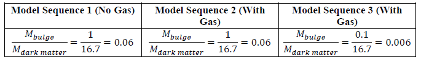
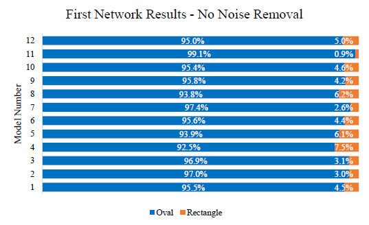
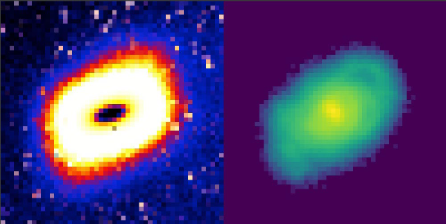

# Automated Galaxy Classification using Deep Learning
The following is a summary of my Master's thesis, completed at the University of Western Australia.

#### Summary
An automated deep learning algorithm capable of automatically screening rare galaxy shapes.
Built using data developed by Dr. Kenji Bekki, a *Principle Research Fellow* at the *International Centre for Radio Astronomy Research in WA*. 
The following skills were deployed during the course of this thesis:
Python, Linux, Tensorflow, Fortran, Machine Learning.

#### Challenges Faced
- Processing countless dynamic interactions using FORTRAN, to train the tensorflow model
- Verification of results through the use of image similarity functions.

## Abstract
The discovery of the rare dwarf galaxy LEDA 074886 has recently led to astronomers hypothesising certain theories on the galaxy evolution of irregular shaped galaxies. These theories suggest that the irregularly shaped LEDA 074886 dwarf galaxy is a result of galaxy mergers. Since the discovery of this irregular, diamond-cut shaped galaxy, these theories have yet to be examined or proven in detail. We have thus successfully developed a method utilising the latest developments in machine learning and image similarity functions, in conjunction with particle simulation data developed by Dr. Kenji Bekki, to investigate previously proposed hypothesis on the evolution of irregular shaped galaxies. Our success with this project comes with the advancements in machine learning, namely deep learning, allowing for classification of similar irregular shaped galaxies, within the simulation data provided by Dr. Bekki. As well as this, with the use of similarity functions we were able to perform subsequent verification of the data developed, solidifying the validity of the results obtained. Moving forward, the method developed would allow for further investigations to be made in the context of increasingly complex galaxy shapes.

## Background
### Machine & Deep Learning
Artificial neural networks mimic the structure of the human brain on a 1-dimensional scale. These networks serve the purpose of accommodating simple mathematical models which, which in turn are used to make further predictions on a given set of data. Machine learning is often completed with human supervision, due to the simple 1-dimensional nature of the model itself.
Deep learning utilises additional hidden layers to accommodate models far complex that that of those handled with machine learning. Deep learning is often used within many of the complex pattern recognitions that govern technology today. The bounds of this technology have yet to be fully tested, especially in the field of astronomy.
This thesis examined deep learning, specifically through the use of convolutional neural networks (CNN), a class of deep learning often applied to the analysis of images. This will be performed with the overall goal of classifying complex galaxy shapes.

### Similarity Functions
The use of similarity functions in some form is essential in the success of this project. With no established method of automating the verification process of the results obtained by our deep learning process, we must establish a new automated framework capable of automatically making comparisons of a specified reference image, with pools of image data.
Due to the structural density of the images that are being examined for this project, a comparison between two classified galaxy images in terms of the pixel by pixel content would not yield any relevant results. These feature images must instead be converted into vectors of dimension ‘n’, thus allowing for mathematical functions to be used in the evaluation of similarity. It is intended that this project will make use of a combination of gradient based similarity functions, an example, the cosine similarity function, as well as more specialised feature extraction methods, examples including the Scale-Invariant Feature Transform Function.

## Methodology
### Dataset Creation
In developing a model neural network capable of accurately predicting data, we must supply data which is accurately labelled and sufficiently complex. This was done through the use of synthesised image simulations. As well as this, we must create data that would subsequently be utilised in the testing of the CNN model. This would be done through the creation of full dynamic simulations.
Dr Bekki provided Fortran scripts able to produce to produce 3 distinct types of full dynamic simulation types, with differing baryonic masses. These models are summarised in the table below:

Table 1: Summary of the three model sequences examined

### Training:
In training the network, the model must be compiled and subsequently run. By default, in Keras3 a TensorFlow backend is defined. This backend is what was used subsequently used for the purpose of this project. Another option included within the Keras framework is the Theano backend. However, a TensorFlow backend was chosen to serve as the overall backend due to the additional complexities involved with developing a framework from the ground up on Theano, within the limited timeframe provided for this project. Meanwhile, TensorFlow provides the added benefit of having established modules, detailed documentation, as well as being industry-backed.
The model is compiled using the Keras compile() function. Two additional parameters were defined. These include the optimizer and loss function.
The optimizer is what allows us to minimise the loss function. Our chosen optimizer was defined as the AdaDelta optimizer, available within the Keras library. When comparing this to more common optimizers such as the gradient descent optimizer, AdaDelta was still well suited for the purpose of this project. This was due to the fact that the AdaDelta optimizer calculates and applies learning rates based on an exponential moving average function. This allows for an automatic learning rate to be applied to the data parameters, depending on the frequency each parameter is visited.
The loss function is used in reducing the error made in subsequent evaluations performed within the model, by updating the weights accordingly. Due to the fact that our data is of a binary classification, we are limited to loss functions which are compatible with binary classifications. The Loss function was subsequently defined as the Cross-Entropy Loss Function. This was selected over its counterpart, the Hinge-Loss Function, due to the fact that the Hinge-Loss function has a predefined margin within which predictions are rated. This margin is quite small, with predictions made outside the limits of the maximum penalised. Cross entropy, on the other hand, assigns errors based on the distance between the probability distribution of predicted and actual classifications, whilst minimising the distance between these distributions. This is ideal for our classification problem, as it would allow for a smooth convergence of the model’s loss, compared to varying results through the use of the Hinge-Loss function.
### Running the Model
Following this, the model was fit using the Keras fit() function. Here, the number of epochs was defined. This parameter describes the number of passes that will be made through the predefined dataset. This was set to 1000, after initial experiments with smaller epoch sizes yielded convergence issues. The resultant model is then saved in two files on the local disk. The weights are saved in the format .h5, whilst the model architecture is saved in the .json format. Storing the model locally would then allow us to transport the architecture between the HPC Cluster, and local machines where we develop our post-processing evaluation scripts.
Subsequent testing of the model was performed using the same environment; Keras3, within Python. The model files (.h5, .json) are loaded using the model_from_json() function, followed by the load_weights() function. Following this, the classification process takes place using the Keras predict function, which takes in the list of test images, created through dynamic simulations, along with the previous model. The sequence then generates an output file (.out) containing resultant binary classification results.
### Feature Extraction
To further validate our deep learning networks accuracy, we looked at narrowing down the classifications made. This was done through a method known as Feature Extraction. The process of implementing a suitable feature extraction technique to validate the classifications made by our model networks, again, involved the use of the python framework. With python vastly simplifying the coding process, much of the focus here was made on collecting suitable results from the subsequent feature extraction techniques, rather than unnecessary debugging.
### Cosine Similarity
This method examines the dot product of two non-zero vectors, which allows for the subsequent calculation of the overall cosine theta between our two vectors. Given these two vectors as A and B, the following formula is used to calculate the angle between the vectors, where 𝐴𝐴∙𝐵𝐵 describe the dot product of two vectors.
The resultant cosine theta will subsequently lie within the range of 0 to 1, allowing for the measure of similarity of two images to be easily quantified using a single number.
Since we require our inputs as vectors, we developed a process capable of converting each input image into this correct format. By using the Pillow module, we can import our images into python as a single array, representative of the image in a grayscale format. This is completed using the PIL.image.open() function available within the Pillow module. With this, the image is flattened into a 1-dimensional array, using Numpys’ flatten() function. The 1-dimensional array is representative of a vector, meaning we can then use these arrays as inputs into our function.
The cosine similarity method was imported through the pre-existing library, known as Scikit-Learn. The function, sklearn.metrics.pairwise.cosine_distances used, calculates the cosine distance between two specified vectors, described within the documentation as simply being 1 minus the cosine similarity result. We therefore minus the result obtained from this function by 1, to give us the cosine similarity. The process was expanded into a batch sequence capable of accepting sets of image data, to test against 1 given reference image. This framework would then allow for us to make comparisons between the LEDA 074886 galaxy, as a reference image, with a series of rectangular classified images with their respective predicted labels.

## Results
### Model Results
With each model containing sets of 3000 images, these image sets were then to be tested against each of our model networks. The results were summarised into 2 sets, based on whether the images tested against the model networks were cleaned through the removal of noise, or raw data. The following plot showcases the distribution of classifications made using our first model network, against raw test data that has not had noise removed:
As mentioned in the introduction, previous theories have suggested these rectangular shaped galaxies to be a cause of major merging. As shown in the results obtained, rectangular shaped galaxies are not found increasingly often with an increase in galaxy mass ratio. As well as this, the network has successfully been able to find the existence of rectangular galaxies as a result of the merging of two galaxies. As shown in Figure 1, with the majority of classifications being elliptical (oval) shaped galaxies and a minority being classified as rectangular, the network is working as expected. This is due to the fact that this spread follows the trend occurrence of these galaxy types, with elliptical (oval) shaped galaxies being the most common galaxy type.

As shown above, the network struggles in distinguishing obround shaped galaxies from the provided test data. In addition to this, the network also has the confidence in being able to distinguish rectangular shaped galaxies. With 80-90% of the models tested above being classified as rectangular, it is highly unlikely that these tested dynamic simulations possess such a large set of rectangular shaped galaxy data. These results may be explained by potential overfitting of the network, due to the network being trained on a majority of rectangular and obround shaped data.

### Cosine Similarity
The cosine similarity test compares two 1-dimensional vectors in terms of their product, and subsequent orientation. This test was conducted with a reference image of the LEDA 074886 galaxy, and images that were classified as “rectangular” from our dataset in Figure 1.
With 4683 out of 10800 images in total being classified as rectangular, in the dataset provided in Figure 1, the batch sequence mentioned was conducted by looping through each of these 4683 images, whilst comparing them to the LEDA 074886 galaxy. This subsequently returned a single rectangular image with the highest achieved similarity of 91.12%, presented below alongside the LEDA 074886 Galaxy:

As shown in the image above, the cosine similarity test is well suited for the comparison of rectangular shaped galaxies due to its ability to distinguish whether two images are essentially parallel or not. With the reference image of the LEDA 074886 galaxy, being the only utilised test image for this process, varying degrees of galaxy orientation were unable to examined. These results are thus limited in the angles it has considered. This may be improved by providing the developed batch process with varying orientations of identified rectangular shaped galaxies, thus allowing for the similarity method to examine a wider range of rectangular classifications made by the CNN.
